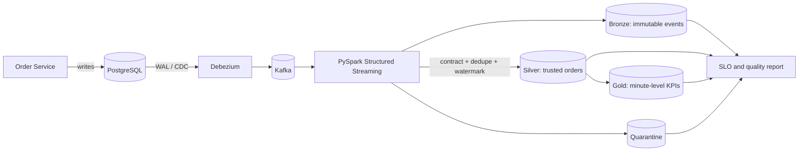

# OrderPulse

**A production-style CDC data platform that turns live commerce transactions into trusted, analytics-ready data.**

OrderPulse is a portfolio project for demonstrating more than ETL syntax. It shows how a data engineer handles change data capture (CDC), duplicate and late events, data contracts, quality failures, dimensional modeling, replay, monitoring, and automated testing.

## The business problem

An online marketplace needs near-real-time answers to three questions:

- How much gross merchandise value (GMV) is being created each minute?
- Which orders changed state, and can every change be audited?
- Can analysts trust the data when events arrive twice, late, or malformed?

OrderPulse captures inserts and updates from an operational PostgreSQL database, publishes them through Debezium and Kafka, and materializes Bronze, Silver, and Gold datasets with PySpark Structured Streaming.



## Why this project is interview-worthy

| Production concern | Evidence in this repository |
|---|---|
| CDC instead of periodic full loads | PostgreSQL logical replication and Debezium connector configuration |
| Idempotency | Event identity and deterministic duplicate removal |
| Out-of-order data | Event-time processing and a configurable watermark |
| Data quality | Versioned data contract, validation rules, and quarantine output |
| Auditability | Immutable Bronze event log with source metadata |
| Analytics modeling | Clean Silver orders and Gold GMV/status aggregates |
| Operability | Freshness, validity, duplicate, and quarantine metrics with SLO evaluation |
| Engineering quality | Unit tests, type-friendly Python, CI, Docker, and architecture decisions |

## Quick demo (no Docker required)

Python 3.11+ is enough for the deterministic local demo. On Windows, the easiest path is:

```powershell
powershell -ExecutionPolicy Bypass -File .\scripts\run_demo.ps1
```

This runs the tests, generates the data, opens a visual control-room dashboard, and serves it at `http://localhost:8000/dashboard/`.

The manual cross-platform commands are:

```bash
python -m pip install -e .
python -m orderpulse.demo --output build/demo
python -m unittest discover -s tests -v
```

The demo deliberately generates valid, duplicate, late, and malformed CDC events. It writes:

```text
build/demo/
  bronze/events.jsonl
  silver/orders.jsonl
  gold/orders_by_minute.jsonl
  quarantine/rejected_events.jsonl
  reports/pipeline_report.json
```

The pure-Python demo makes contract, deduplication, late-event, current-state, and SLO rules easy to test in CI. `jobs/stream_orders.py` demonstrates the distributed ingestion, validation, watermarking, and event-aggregation path; a production current-state projection should use a transactional sink such as Delta Lake or BigQuery rather than local Parquet.

## Full local platform

Prerequisites: Docker Desktop with at least 8 GB of memory.

```bash
docker compose -f infra/docker-compose.yml up -d
python -m pip install -e ".[source]"
python scripts/register_connector.py
python scripts/seed_orders.py --count 1000
```

Services:

- PostgreSQL: `localhost:5432`
- Kafka-compatible Redpanda broker: `localhost:19092`
- Kafka Connect + Debezium: `localhost:8083`
- Redpanda Console: `http://localhost:8080`

Run the Spark job with your local Spark installation or package it for Dataproc/EMR:

```bash
spark-submit \
  --packages org.apache.spark:spark-sql-kafka-0-10_2.12:3.5.6 \
  jobs/stream_orders.py
```

## Data contract

Every change event is normalized to this logical contract:

| Field | Type | Rule |
|---|---|---|
| `event_id` | string | Required and stable across replays |
| `order_id` | string | Required |
| `customer_id` | string | Required |
| `status` | string | One of CREATED, PAID, SHIPPED, DELIVERED, CANCELLED |
| `amount` | decimal | Non-negative |
| `currency` | string | ISO-like three-letter uppercase code |
| `event_time` | timestamp | UTC event time used for watermarks |
| `operation` | string | CDC operation: create, update, delete, or read |

The executable contract lives in `src/orderpulse/contracts.py`.

## Failure scenarios to discuss in an interview

1. **Kafka redelivers an event:** stable `event_id` makes the Silver write idempotent.
2. **An older update arrives after a newer one:** the latest `(event_time, source_offset)` wins.
3. **A producer sends `amount = -1`:** the event remains in Bronze but is routed to quarantine, not Silver.
4. **The stream stops:** freshness exceeds the configured SLO and the report becomes unhealthy.
5. **The schema changes:** the contract version is explicit; incompatible events fail closed into quarantine.
6. **A consumer must rebuild state:** replay Bronze from a recorded checkpoint instead of querying the source database again.

## Repository map

```text
src/orderpulse/       Tested domain, quality, transformation, and SLO logic
jobs/                  PySpark Structured Streaming implementation
infra/                 PostgreSQL, Redpanda, and Debezium local stack
sql/                   Source schema and seed data
scripts/               Connector registration and source-data generation
tests/                 Unit tests for the difficult correctness cases
docs/                  Architecture decisions and recruiter demo script
dashboard/             Zero-dependency visual control room
```

See `docs/runbook.md` for the complete operational walkthrough and `docs/production-roadmap.md` for the industry-hardening plan.

If you are preparing for interviews, start with `docs/interview-guide.md`. It explains the system from beginner concepts through common architecture and reliability questions.

## Free public deployment

The dashboard can be published free through GitHub Pages. The included `deploy-pages` workflow runs the tests, regenerates the demo data, assembles the static site, and deploys it after every push to `main`.

Follow `docs/deploy-github-pages.md` for the beginner-friendly setup. The resulting URL will normally be `https://YOUR-USERNAME.github.io/orderpulse-cdc-platform/`.

## Roadmap

- [x] Deterministic CDC simulator and medallion outputs
- [x] Contract validation, quarantine, deduplication, late-event logic, and SLO report
- [x] PySpark Structured Streaming job and local CDC infrastructure
- [x] Automated unit tests and GitHub Actions workflow
- [ ] Add OpenLineage/Marquez lineage metadata
- [ ] Materialize latest order state with a transactional Delta/BigQuery merge
- [ ] Deploy the Spark path on GCP Dataproc with GCS and BigQuery sinks
- [ ] Publish a 3-minute benchmark with throughput, p95 latency, and cost assumptions

## Resume-ready description

Do not publish performance numbers until you run and record a benchmark.

> **OrderPulse - CDC Commerce Data Platform** | Python, PySpark, Kafka, Debezium, PostgreSQL, Docker  
> Built a CDC-driven lakehouse that captures transactional database changes through Debezium and Kafka and transforms them into Bronze, Silver, and Gold datasets with PySpark Structured Streaming. Implemented event-time watermarks, deterministic deduplication, schema validation, bad-record quarantine, replayable checkpoints, data-quality SLOs, automated tests, and CI.

## License

MIT
